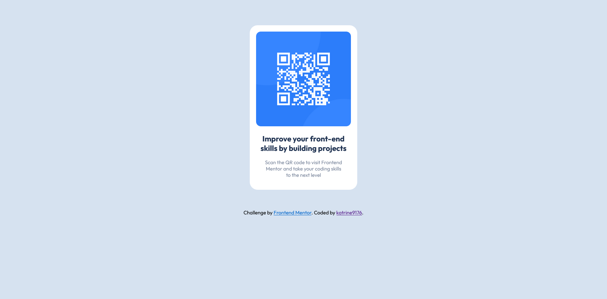
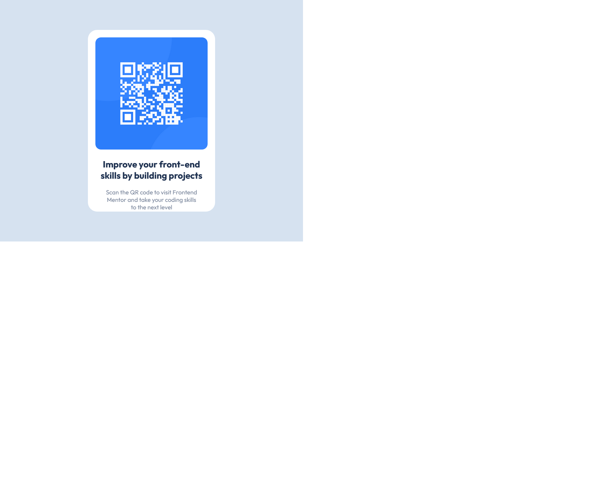

# Frontend Mentor - QR code component solution

This is a solution to the [QR code component challenge on Frontend Mentor](https://www.frontendmentor.io/challenges/qr-code-component-iux_sIO_H). Frontend Mentor challenges help you improve your coding skills by building realistic projects. 

## Table of contents

- [Overview](#overview)
  - [Screenshot](#screenshot)
  - [Links](#links)
- [My process](#my-process)
  - [Built with](#built-with)
- [Author](#author)

**Note: Delete this note and update the table of contents based on what sections you keep.**

## Overview

### Screenshot

It is desktop view.
 It is tablet view.
 It is mobile view.
 

### Links

- Solution URL: [Solution URL](https://github.com/katrine9176/QR-component-Frontendmentor)
- Live Site URL: [live site URL](https://katrine9176.github.io/QR-component-Frontendmentor/)

## My process

1. Make basic html structure, add sass.
2. Make mobile view.
3. Make tablet view.
4. Make desktop view.
5. Added div attribution.

That's all.

### Built with

- SASS,
- Flexbox.

## Author

- Frontend Mentor - [@katrine9176](https://www.frontendmentor.io/profile/katrine9176)

